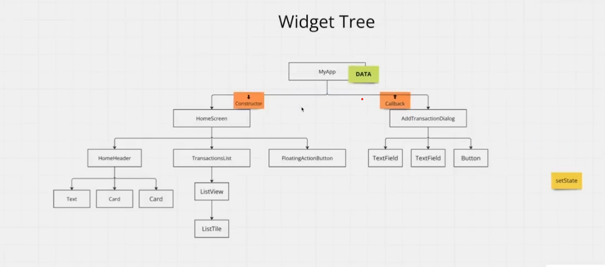

flutter doctor sirve para ver si esta bien instalado


# para centrar elementos

```dart
 body: Stack(
          children: [
                   Image(image: AssetImage('assets/images/avion.png')),
            Text(' aaasa', style: TextStyle(fontSize: 140, color: Colors.red),
            ),

```

el stack tiene una propiedad que es alignment

# Cambiar icono de app

usamos la utilidad https://icon.kitchen/

iconos de android en Hola_Mundo\hola_mundo\android\app\src\main\res
iconos IOS EN Hola_Mundo\hola_mundo\ios\Runner\Assets.xcassets\AppIcon.appiconset


# WIDGETS

TIPOS DE WIDGETS

StatelessWidget = no cambia con el tiempo.

StatefulWidget = sí cambia, puede redibujarse cuando hay interacción o datos nuevos.

ejemplo para cambiar de color a travez de botones


```dart
import 'package:flutter/material.dart';

void main() {
  runApp(const MyApp());
}

class MyApp extends StatelessWidget {
  const MyApp({super.key});

  // This widget is the root of your application.
  @override
  Widget build(BuildContext context) {
    return MaterialApp(
      title: 'Flutter Demo',
      theme: ThemeData(
        // This is the theme of your application.
        //
        // TRY THIS: Try running your application with "flutter run". You'll see
        // the application has a purple toolbar. Then, without quitting the app,
        // try changing the seedColor in the colorScheme below to Colors.green
        // and then invoke "hot reload" (save your changes or press the "hot
        // reload" button in a Flutter-supported IDE, or press "r" if you used
        // the command line to start the app).
        //
        // Notice that the counter didn't reset back to zero; the application
        // state is not lost during the reload. To reset the state, use hot
        // restart instead.
        //
        // This works for code too, not just values: Most code changes can be
        // tested with just a hot reload.
        colorScheme: ColorScheme.fromSeed(seedColor: Colors.deepPurple),
        useMaterial3: true,
      ),
      home: const HomePage(),
    );
  }
}

// Creando Widget desde cero
// class HomePage extends StatelessWidget { DEBEMOS CONVERTIR A STATEFILWIDGET PARA QUE CAMBIE DE COLOR
class HomePage extends StatefulWidget {
  const HomePage({super.key});

  @override
  State<HomePage> createState() => _HomePageState();
}

class _HomePageState extends State<HomePage> {

  Color textColor = Colors.purple;

  void changeColor(Color color){
    setState(() {
      textColor = color;
    });
  }

// Metodo build
  @override
  Widget build(BuildContext context) {

// Color textColor = Colors.purple;

    return Scaffold(
// backgroundColor: Colors.white,
      body: Center(
        child: Column(
               mainAxisAlignment: MainAxisAlignment.center, // centra en vertical
          children: [
            Row(
                mainAxisAlignment: MainAxisAlignment.spaceEvenly, // espaciado de  widgets
              children: [
                GestureDetector(
                  onTap: () {
                    // textColor = Colors.red;
                    changeColor(Colors.red);
                  },

                  child: Container(width: 100, height: 100, color: Colors.red)),

                GestureDetector(
                  onTap: () {
                  //  textColor = Colors.purple;
                    changeColor(Colors.purple);


                  },
                  child:
                      Container(width: 100, height: 100, color: Colors.purple)),


                GestureDetector(
                  onTap: () {
                    // textColor = Colors.blueAccent;
                    changeColor(Colors.blue);
                  },
                  child: Container(width: 100, height: 100, color: Colors.blueAccent)
                  ),

            ],),

            SizedBox(height: 50,),
            Text('Color',
            style: TextStyle(fontSize: 50, color: textColor),
            ),
          ],
        )
      ),
    );
  }
}


```dart


# Listas

```dart

  final List<String> frutas = ['Mango', 'Manzana', 'Banano', 'Sandia'];

  //  print(frutas[3]);

  //  print(frutas.indexOf('Banano1'));

  print(frutas.length);

  frutas.add('Pera');

  print(frutas.length);

  //insertar donde uno quiera

  frutas.insert(1, 'Frutilla');

  print(frutas);

  print(frutas.first);
  print(frutas.last);

  ```

  # Mapas

```dart

    final Map<String,int> contactos = {
    'Mama': 12345,
    'PAPA': 2321412,
    'Sorella': 4124312

  };

  print(contactos.length);
  print(contactos['Mama']);

  ```


  # Clases

  En Dart no existe la sobrecarga de constructores como en Java o C#.
Pero se puede lograr un efecto parecido de dos formas:


```dart

class Auto {
  final int puertas;
  final String color;

  Auto({int? puertas, String? color})
      : puertas = puertas ?? 4,
        color = color ?? 'Negro';

  void reversa() {
    print('El auto está en reversa');
  }
}

void main() {
  final auto1 = Auto(); // usa 4 puertas y color Negro
  final auto2 = Auto(puertas: 2, color: 'Rojo'); // usa los parámetros dados

  print('Auto1: ${auto1.puertas} puertas, color ${auto1.color}');
  print('Auto2: ${auto2.puertas} puertas, color ${auto2.color}');
}
```

si no pasas nada, usa los valores por defecto.
Si pasas parámetros, usa esos valores.

## Navegacion (routes)


# Navegacion anomima

```dart
<!-- Hola_Mundo\navigation\lib\screens\screens1.dart -->
import 'package:flutter/material.dart';
import 'package:navigation/screens/screen2.dart';

class Screens1 extends StatelessWidget {
  const Screens1({super.key});

  @override
  Widget build(BuildContext context) {
    return Scaffold(
      appBar: AppBar(

        title: const Text('Screens 1')

        ),
        body: Center(
          child: ElevatedButton(
            onPressed: () {
              Navigator.push(context, MaterialPageRoute(builder: (context) =>
              const Screens2(),));
            },
            child: const Text('ir a la Screens 2'),
          ),
        )
    );
  }
}

<!-- lib\screens\screen2.dart -->


import 'package:flutter/material.dart';

class Screens2 extends StatelessWidget {
  const Screens2({super.key});

  @override
  Widget build(BuildContext context) {
    return Scaffold(
      appBar: AppBar(

        title: const Text('Screens 2'),
        automaticallyImplyLeading: false,
        ),
        body: Center(
          child: ElevatedButton(
            onPressed: () {
              Navigator.pop(context);
            },
            child: const Text('volver a screen 1'),
          ),
        )
    );
  }
}

<!-- Main -->

import 'package:flutter/material.dart';
import 'package:navigation/screens/screens1.dart';

void main() {
  runApp(const MainApp());
}

class MainApp extends StatelessWidget {
  const MainApp({super.key});


  @override
  Widget build(BuildContext context) {
    return MaterialApp(
      home: Screens1()
      );


  }
 }

```


# buenas practicas (routes)

```dart

<!-- ESTE ES EL ARCHIVO ACTUAL CON SUS RUTAS -->

import 'package:flutter/material.dart';
import 'package:navigation/screens/screen2.dart';
import 'package:navigation/screens/screens1.dart';

void main() {
  runApp(const MainApp());
}

class MainApp extends StatelessWidget {
  const MainApp({super.key});


  @override
  Widget build(BuildContext context) {
    return MaterialApp(
      // home: Screens1(),
      // usando propiedad de la clase Screens1
     initialRoute:  Screens1.routeName,
    //  s
      routes:{
        Screens1.routeName:(context) => const Screens1(),

       Screens2.routeName:(context) => const Screens2(),
      } ,
      );


  }
 }
```

<!-- PARA TENER BUENAS PRACTICAS GENERAREMOS UN ONGENERATORROUTES -->


 lib\routes\appRouter.dart

```dart


import 'package:flutter/material.dart';
import 'package:navigation/routes/Routes.dart';
import 'package:navigation/screens/screen2.dart';
import 'package:navigation/screens/screens1.dart';

class AppRouter {
  static Route onGenerateRoute(RouteSettings settings) {

     switch (settings.name) {
      case Routes.screen1:
        return MaterialPageRoute(builder: (_) => const Screens1());
      case Routes.screen2:
        return MaterialPageRoute(builder: (_) => const Screens2());
      default:
        return MaterialPageRoute(
          builder: (_) => const Scaffold(
            body: Center(
              child: Text('No route defined'),
            ),
          ),
        );
    }
  }
}

```

lib\routes\routes.dart

```dart
class Routes {
  static const String screen1 = '/';
  static const String screen2 = '/screen2';
}
```


lib\screens\screens1.dart

```dart
import 'package:flutter/material.dart';
import 'package:navigation/routes/Routes.dart';
// import 'package:navigation/screens/screen2.dart';

class Screens1 extends StatelessWidget {
  const Screens1({super.key});

// Propieta dalla clase
  static const String routeName = '/'; // <-- Agrega esta línea

  @override
  Widget build(BuildContext context) {
    return Scaffold(
      appBar: AppBar(

        title: const Text('Screens 1')

        ),
        body: Center(
          child: ElevatedButton(
            onPressed: () {
              // Navigator.push(context, MaterialPageRoute(builder: (context) =>       const Screens2(),));
              Navigator.pushNamed(context, Routes.screen2);

            },
            child: const Text('ir a la Screens 2'),
          ),
        )
    );
  }
}

```


lib\screens\screen2.dart

```dart
import 'package:flutter/material.dart';

class Screens2 extends StatelessWidget {
  const Screens2({super.key});

  // static String routeName = '/screen2';

  @override
  Widget build(BuildContext context) {
    return Scaffold(
      appBar: AppBar(

        title: const Text('Screens 2'),
        automaticallyImplyLeading: false,
        ),
        body: Center(
          child: ElevatedButton(
            onPressed: () {
              Navigator.pop(context);
            },
            child: const Text('volver a screen 1'),
          ),
        )
    );
  }
}
```

lib\main.dart

```dart
import 'package:flutter/material.dart';
import 'package:navigation/routes/appRouter.dart';
// import 'package:navigation/screens/screen2.dart';
// import 'package:navigation/screens/screens1.dart';

void main() {
  runApp(const MainApp());
}

class MainApp extends StatelessWidget {
  const MainApp({super.key});

  @override
  Widget build(BuildContext context) {
    // final AppRouter appRouter = AppRouter();

    return const MaterialApp(
      // home: Screens1(),
      // usando propiedad de la clase Screens1
      initialRoute: '/',
      onGenerateRoute: AppRouter.onGenerateRoute,
    );
  }
}
```

## PARTE 2

## USO DE LIBRERIAS

[currency text input formatter](https://pub.dev/packages/currency_text_input_formatter)

se usa en lib\view\components\add_transactions_dialog.dart

para su instalacion modificar el archivo pubspec.yaml

```dart

import 'package:currency_text_input_formatter/currency_text_input_formatter.dart';
import 'package:flutter/cupertino.dart';
import 'package:flutter/material.dart';

class AddTransactionsDialog extends StatefulWidget {
  const AddTransactionsDialog({super.key});

  @override
  State<AddTransactionsDialog> createState() => _AddTransactionsDialogState();
}

class _AddTransactionsDialogState extends State<AddTransactionsDialog> {
     int? typeIndex = 0;
  @override
  Widget build(BuildContext context) {
    final textTheme = Theme.of(context).textTheme;


    return  SizedBox(
      height: 680,
      width: double.infinity,
      child: Column(
        children: [
          Container(
            margin: EdgeInsets.only(top: 12),
            height: 6,
            width: 40,
            decoration: BoxDecoration(
              color: Colors.grey.shade300,
              borderRadius: BorderRadius.circular(10),
            ),
          ),
          const Padding(
            padding: EdgeInsets.all(20),
            child: Text('New Transaction', style: TextStyle(fontSize: 20, color: Colors.teal,  fontWeight: FontWeight.bold,),),
          ),
          CupertinoSlidingSegmentedControl(
            groupValue: typeIndex,
            children: const {
            0: Text('Expense'),
            1: Text('Income'),
          }, onValueChanged: (value) {
            setState(() {
            typeIndex = value;

            });
          }),

          const SizedBox(height: 20,),
          // Text("Amount"), style: textTheme.bodySmall.copyWidth(color: Colors.teal),
          Text("AMOUNT", style: textTheme.bodySmall!.copyWith(color: Colors.teal),),

          TextField(
            inputFormatters: [CurrencyTextInputFormatter.currency(symbol: '\$')], //aca se usa
            textAlign: TextAlign.center,
            decoration: const InputDecoration.collapsed(hintText: '\$ 0.00'),
            keyboardType: TextInputType.number,
          )
        ],
      ),
    );


  }
}
```

# Manejar datos entre vistas




## 🔄 Flujo de datos entre vistas

### MyApp (raíz)
- Mantiene el **estado global** (ej: lista de transacciones).
- Pasa los datos a **HomeScreen** mediante el **constructor**.
- Pasa un **callback** a **AddTransactionDialog** para manejar nuevas transacciones.

### HomeScreen
- Recibe los datos desde **MyApp**.
- Distribuye la información a sus hijos:
  - **HomeHeader** → muestra balance/resumen.
  - **TransactionsList** → renderiza las transacciones en un `ListView`.
  - **FloatingActionButton** → abre `AddTransactionDialog`.

### AddTransactionDialog
- Contiene `TextField` y `Button` para capturar datos de la nueva transacción.
- Al presionar el botón, se ejecuta el **callback recibido de MyApp**, enviando los datos de la transacción.

### setState en MyApp
- Actualiza la **lista de transacciones**.
- Provoca que el **árbol de widgets se reconstruya**.
- **HomeScreen** recibe la lista actualizada y refleja el cambio en pantalla.

---

## 📌 Resumen
- Los **datos bajan** desde `MyApp` hacia `HomeScreen` vía **constructores**.
- Las **acciones del usuario suben** desde `AddTransactionDialog` hacia `MyApp` vía **callbacks**.
- `setState` en `MyApp` asegura que la **UI siempre esté sincronizada**.
